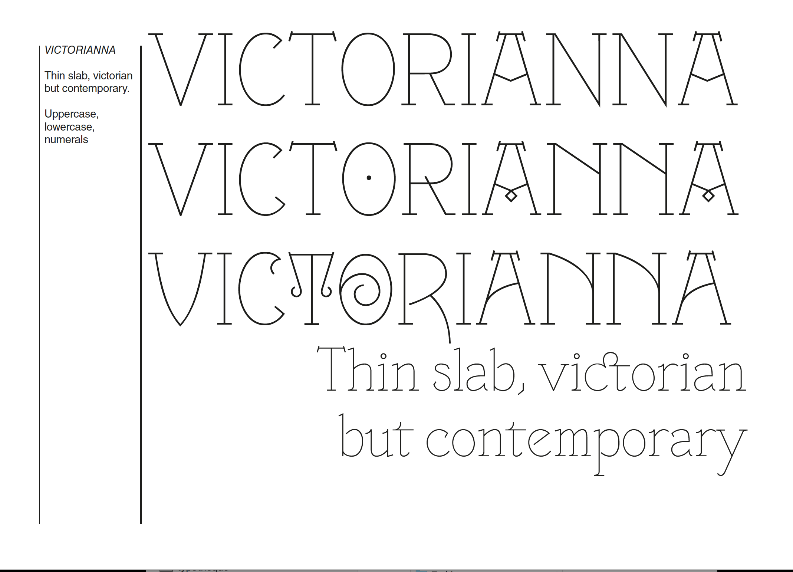

# Victorianna

Thin roman & italic font, inspired by english victorian types. Thin roman: 3 titling styles on caps, ligatures on lower cases. Thin italic: many ligatures on lower cases. Originally drawn by Sébastien Hayez, then developed by Jérémy Landes.
